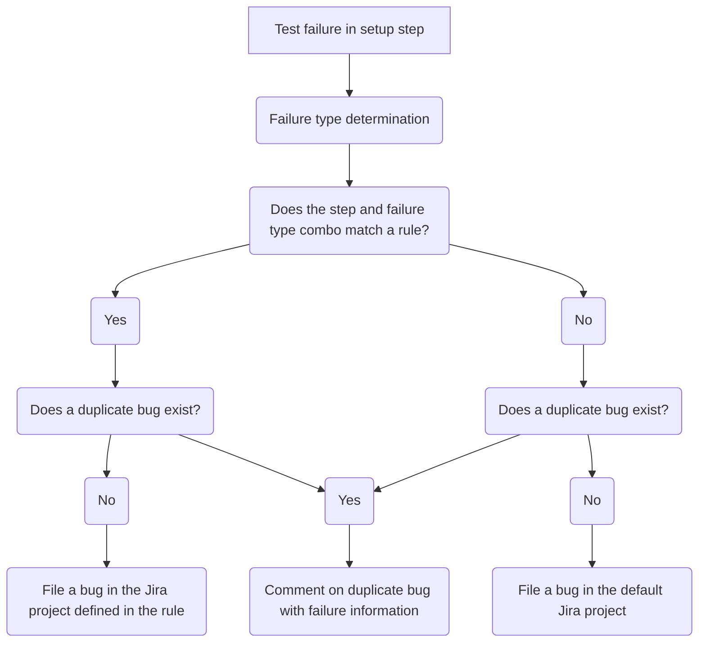

# Reporting Guide<!-- omit from toc -->

## Table of Contents<!-- omit from toc -->

- [TestGrid](#testgrid)
  - [What is TestGrid?](#what-is-testgrid)
  - [How do I Report Jobs to TestGrid?](#how-do-i-report-jobs-to-testgrid)
  - [TestGrid Dashboard Creation and Modification Automation](#testgrid-dashboard-creation-and-modification-automation)
- [Slack](#slack)
  - [How to Setup Slack Alerts for a Scenario](#how-to-setup-slack-alerts-for-a-scenario)
- [Failure Handling (Jira)](#failure-handling-jira)
  - [How Failures Are Reported to Jira](#how-failures-are-reported-to-jira)
    - [Example](#example)
  - [How To Add Jira Reporting to a Scenario](#how-to-add-jira-reporting-to-a-scenario)
- [Component Readiness](#component-readiness)
  - [General Information](#general-information)
  - [Sippy](#sippy)
  - [CI Test Mapping](#ci-test-mapping)

## TestGrid

### What is TestGrid?

TestGrid is a Kubernetes community project that allows users to create dashboards of Prow job results. TestGrid uses its configuration files to build these dashboards, retrieve the Prow job results of all CI Operator Jobs defined in the dashboards, and displays the results in a grid pattern.

Please see the following resources for more information about TestGrid:

- [TestGrid Homepage](https://testgrid.k8s.io/)
- [TestGrid Documentation and Source Code](https://github.com/kubernetes/test-infra/tree/master/testgrid)

### How do I Report Jobs to TestGrid?

We have been able to eliminate a manual process for reporting CI Operator Jobs to TestGrid. The most important thing to know about how CI Operator Jobs are reported to the `-lp-interop` dashboards in TestGrid is that the automation that makes it happen looks for the unique identifier `-lp-interop` in the name of the Prow job.

As you may have read in other documents in this repository, you will need to append `-lp-interop` to the end of of your configuration file's filename when you create it. When we create configuration files in OpenShift CI, as you may know, the format for the filenames is `{GitHub Organization}-{GitHub Repository}-{Branch}__****.yaml`. After the `{Branch}` section of the filename, anything can be appended to the end. The text appended to the end is called a "variant". The use of variants will come in handy if we test multiple versions of a layered product or of OpenShift. Please add `-lp-interop` to the "variant" section of the filename.

**Examples:**

- `ci-operator/config/windup/windup-ui-tests/windup-windup-ui-tests-main-lp-interop.yaml`: Will be reported because `-lp-interop` is in the filename.
- `ci-operator/config/windup/windup-ui-tests/windup-windup-ui-tests-main.yaml`: Will NOT get reported because `-lp-interop` is not found in the filename.

### TestGrid Dashboard Creation and Modification Automation

The automation we use to automatically create and modify dashboards in TestGrid can be found in the [openshift/ci-tools](https://github.com/openshift/ci-tools) repository. We utilize the [testgrid-config-generator] tool in that repository to find any Prow jobs that contain either `-lp-interop` in their names. If a new Prow job is found that isn't being reported, the tool will create a new dashboard or modify an existing dashboard to report that CI Operator Job to TestGrid appropriately. After the tool has run, it will create a pull request in the [kubernetes/test-infra][kubernetes-test-infra] repository to finalize the changes.

The [testgrid-config-generator] tool is run daily and you should not need to force it to run. After the tools runs, it may take some time for the pull request to be merged into the [kubernetes-test-infra] repository. Once the pull request is merged, it will start to show in TestGrid.

To add support for automatically detecting layered product interoperability CI Operator Jobs, a [PR](https://github.com/openshift/ci-tools/pull/3289) was opened to [testgrid-config-generator] support these unique identifier.

> **NOTE:**
>
> The only CI Operator Jobs that will be automatically reported in TestGrid are the CI Operator Jobs in the `main` branch of the [openshift/release](https://github.com/openshift/release).

**Verification:** After the [testgrid-config-generator] pull request is merged into [kubernetes-test-infra], confirm your CI Operator Job appears in the expected `-lp-interop` TestGrid dashboard the following day.

## Slack

[OpenShift CI allows to set up Slack alerts](https://docs.ci.openshift.org/docs/how-tos/notification/) for our scenarios. The CSPI Interop team has decided that we should set up this Slack integration for each of our scenarios. Each scenario should alert to the Slack channel that product QE decides. The channel must be public and in redhat-internal.slack.com.

### How to Setup Slack Alerts for a Scenario

1. In the [openshift/release](https://github.com/openshift/release) repository, after you have created a CI configuration file for your scenario in the `ci-operator/config/...` directory and ran the `make update` or `make jobs` command, you should be able to find a CI Operator Job file for your CI configuration generated under `ci-operator/jobs/....`. Find the CI Operator Job file that ends in `-periodics.yaml` and open it.
2. This file may contain multiple periodic CI Operator Jobs for the same repository, so find the periodic CI Operator Job that matches the CI configuration you'd like alerts for. If you are working with layered product interop testing, the CI Operator Job name should include `-lp-interop`. In this example, the CI Operator Job name is `periodic-ci-windup-windup-ui-tests-v1.0-mtr-ocp4.13-lp-interop-mtr-interop-aws`.
3. Add a reporter_config stanza, replace the `channel:` value with the channel you're PQE team would like to use and update the `report_template:` with a different message (if you'd like to, this one is very generic and will work in most cases):

```yaml
  name: periodic-ci-windup-windup-ui-tests-v1.0-mtr-ocp4.13-lp-interop-mtr-interop-aws
  reporter_config:
    slack:
      channel: '#mtr-interop'
      job_states_to_report:
      - success
      - failure
      - error
      report_template: '{{if eq .Status.State "success"}} :slack-green: Job *{{.Spec.Job}}*
        ended with *{{.Status.State}}*. <{{.Status.URL}}|View logs> {{else}} :failed:
        Job *{{.Spec.Job}}* ended with *{{.Status.State}}*. <{{.Status.URL}}|View
        logs> {{end}}'
```

4. Commit your changes and open a Pull Request.

> **IMPORTANT**
>
> Please see the [official documentation](https://docs.ci.openshift.org/docs/how-tos/notification/) for more information about how to configure Slack alerts further.


[testgrid-config-generator]: https://github.com/openshift/ci-tools/tree/master/cmd/testgrid-config-generator
[kubernetes-test-infra]: https://github.com/kubernetes/test-infra

## Failure Handling (Jira)

### How Failures Are Reported to Jira

Failures are reported to Jira using the [firewatch tool](https://github.com/CSPI-QE/firewatch). This tool is used to react to failures in OpenShift CI Operator Jobs. This tool uses a configuration defined for each CI Operator Job to help it determine how it should report certain bugs. For a more technical understanding of how to use the tool and build the configuration properly, please see the documentation below:

- [Getting started](https://github.com/CSPI-QE/firewatch/blob/main/README.md)
- [How to define the configuration](https://github.com/CSPI-QE/firewatch/blob/main/docs/cli_usage_guide.md#defining-the-configuration)

#### Example

For the purposes of how this automation works, here is a fairly simple example:

Each CI Operator Job in OpenShift CI consists of different steps, for this example we will say our CI Operator Job has three steps: `setup`, `test`, and `teardown`. In each of these steps, as far as the automation is concerned, there are two types of failures: `pod_failure` which means the step's script exited with a non-zero exit code and `test_failure` which means the step generated a JUnit XML file and a failure in the XML was found.

For this example, lets set some plain-english rules to make it a little easier to understand:

- If there is any type of failure in the `setup` step, report it to Interop QE (INTEROP Jira project)
- If there is any type of failure in the `teardown` step, report it to Interop QE (INTEROP Jira project)
- If there is a `pod_failure` found in the `test` step, report it to Interop QE (INTEROP Jira project)
- If there is a `test_failure` found in the `test` step, report it to Product QE (PQE Jira project)

Using the logic outlined above, we can generate a firewatch config that will result in bugs being filed to the right teams with as much information as possible to help the engineer looking at the bug. The configuration for this logic would look something like this:

```json
{
"failure_rules":
[
  {"step": "setup", "failure_type": "all", "classification": "Lorem Ipsum", "jira_project": "INTEROP", "group": {"name": "cluster", "priority": 1}, "jira_additional_labels": ["!default"]},
  {"step": "test", "failure_type": "pod_failure", "classification":  "Lorem Ipsum", "jira_project": "INTEROP", "group": {"name": "lp-tests", "priority": 1}, "jira_additional_labels": ["!default", "interop-tests"]},
  {"step": "test", "failure_type": "test_failure", "classification":  "Lorem Ipsum", "jira_project": "PQE", "group": {"name": "lp-tests", "priority": 1}, "jira_additional_labels": ["!default", "interop-tests"]},
  {"step": "teardown", "failure_type": "all", "classification": "Lorem Ipsum", "jira_project": "INTEROP", "group": {"name": "cluster", "priority": 2}, "jira_additional_labels": ["!default"]}
]
}
```

For the sake of this documentation, we will not go very deep into this configuration (again, see the documentation linked above) but this configuration will result in the plain-english rules we outlined earlier. Here is a highly-simplified flowchart of how this works:



### How To Add Jira Reporting to a Scenario

**If you currently use the ipi-aws workflow:**

1. Ask your PQE contact which Jira project they would like test failures to be reported to
2. Modify the scenario to use the `firewatch-ipi-aws` workflow instead of the `ipi-aws` workflow
3. Add the required environment variables:
   - `FIREWATCH_DEFAULT_JIRA_PROJECT`: This is the Jira project you'd like tickets to be filed to if the failure found does not match any rules. For Interop QE, this will probably be set to `LPINTEROP`
   - `FIREWATCH_CONFIG`: Where we define the rules for which tickets get filed where. Please see the [How to define the configuration](https://github.com/CSPI-QE/firewatch/blob/main/docs/cli_usage_guide.md#defining-the-configuration) section of the Firewatch documentation for help defining this variable.
   - `FIREWATCH_JIRA_SERVER`: `https://issues.redhat.com`
     - This value always defaults to the stage server to avoid unwanted bugs.
   - `FIREWATCH_DEFAULT_JIRA_ADDITIONAL_LABELS` : Adding the following 3 labels to every firewatch config step: `["<ocp-version>-lp","self-managed-lp","<scenario-short-name-lp>"]`

**If you currently use a custom workflow:**

1. Add the `firewatch-report-issues` ref to the end of the post steps in your workflow
2. Ask your PQE contact which Jira project they would like test failures to be reported to
3. Add the required environment variables:
   - `FIREWATCH_DEFAULT_JIRA_PROJECT`: This is the Jira project you'd like tickets to be filed to if the failure found does not match any rules. For Interop QE, this will probably be set to `LPINTEROP`
   - `FIREWATCH_CONFIG`: Where we define the rules for which tickets get filed where. Please see the [How to define the configuration](https://github.com/CSPI-QE/firewatch/blob/main/docs/cli_usage_guide.md#defining-the-configuration) section of the Firewatch documentation for help defining this variable.
   - `FIREWATCH_JIRA_SERVER`: `https://issues.redhat.com`
     - This value always defaults to the stage server to avoid unwanted bugs.
   - `FIREWATCH_DEFAULT_JIRA_ADDITIONAL_LABELS` : Adding the following 3 labels to every firewatch config step: `["<ocp-version>-lp","<platform-name>-lp","<scenario-short-name-lp>"]`

Please see [this PR](https://github.com/openshift/release/pull/39700/files) as an example of how to add these values to your CI Operator Job configuration.

> **IMPORTANT**
>
> When defining the `FIREWATCH_CONFIG` variable, please try to cover every step that is executed during your CI Operator Job, you can view the steps that are run by going to a recent run of your CI Operator Job and viewing the artifacts. Each step should have a folder for it's artifacts and logs that you can use to build your config. If you happen to miss one of the steps and a failure occurs in that step, it will cause the failure to not match any of the rules in the config. In that case, a generic bug for the failure will be filed in the `FIREWATCH_DEFAULT_JIRA_PROJECT` project.

## Component Readiness

This section explains how Layered Product (LP) CI Operator Job run results appear in **[Component Readiness](https://sippy.dptools.openshift.org/sippy-ng/component_readiness/main)** (CR), a Sippy-based tool where LP Interop test historical health is tracked.

### General information

- **LP Interop Component Readiness view:** The LP Interop Dashboard View is named `<OCPRelease>-LP-Interop`, where `<OCPRelease>` is the OpenShift Minor Release the LPs are installed on (Sippy groups the Dashboard View based on the OpenShift Core Platform (OCP) y-stream releases). For example, `OCP 4.22` based LPs will have Dashboard View named as `4.22-LP-Interop`.
  - Open [CR](https://sippy.dptools.openshift.org/sippy-ng/component_readiness/main), and click `View` on the top-left:

    

    Then select the desired Dashboard View `<OCPRelease>-LP-Interop`, or use a direct URL, such as [4.22-LP-Interop](https://sippy.dptools.openshift.org/sippy-ng/component_readiness/main?view=4.22-LP-Interop).
  - **Where views are defined:** Supported releases and their view IDs are listed in Sippy's [config/views.yaml](https://github.com/openshift/sippy/blob/main/config/views.yaml). Search for `component_readiness` entries with names ending in `-LP-Interop`; this file serves as the source of truth when selecting the correct `view=` query for a specific OCP release.
  - **Release rotation:** When a new OpenShift Minor Release is shipped, the Release Team (TRT) adds the matching `<ocpMinorRelease>-LP-Interop` entry to `config/views.yaml` automatically.
- **Maintainers:** Sippy and CR are maintained by TRT. Use `#forum-ocp-release-oversight` on Slack to contact them.

To properly configure the CI Operator configuration for a CI Operator Job so that it is parsed by CR correctly, please refer to [Make a Job CR-Compliant](../Scenario_Development/Scenario_Development_Guide.md#make-a-job-cr-compliant) in the Scenario Development Guide.

### Sippy

This checklist covers the changes required in [Sippy](https://github.com/openshift/sippy) to onboard a CI Operator Job for a new LP.

---

#### Prerequisites: gather required information

1. **JUnit Test Suite (TS) name prefix**: Identify the TS name prefix in the JUnit results produced by the CI Operator Job. See [Map the JUnit tests output](../Scenario_Development/Scenario_Development_Guide.md#map-the-junit-tests-output) in the Scenario Development Guide on how to add the prefix if the actual tests do not produce a TS with a consistent prefix.

2. **Stable substring of periodic CI Operator Job name**: Within the [openshift/release](https://github.com/openshift/release/) GitHub Repository, under CI Jobs `periodics` files (`ci-operator/jobs/**/*-periodics.yaml`), identify a stable substring present in the relevant `periodics[].name` value (e.g. `-lp-interop-cr-my-comp`). The CR Variant Registry matches **literal substrings** on the lowercased CI Operator Job name (first match wins). 

---

#### 1. Allow importing tests: `pkg/db/suites.go`

**File:** [pkg/db/suites.go](https://github.com/openshift/sippy/blob/main/pkg/db/suites.go)

**Variable:** **`testSuitePatterns`** (`[]*regexp.Regexp`)

For **standard LP interop onboarding**, **do not** add product-specific suite strings to **`testSuites`**. Instead, rely on **`testSuitePatterns`**: ensure every suite-name prefix CI produces is covered by a regex. Current upstream patterns already include LP-oriented patterns such as `^lp-chaos--`, `^lp-interop--`, and `^lp-ocp-compat--` (see `testSuitePatterns` in [suites.go](https://github.com/openshift/sippy/blob/main/pkg/db/suites.go#L80)). As long as your CI output follows the `^lp-ocp-compat--` pattern, no new entry is required in this file.

- **New prefix family:** If CI introduces suite names that **do not** match any existing pattern, add **`regexp.MustCompile(...)`** to **`testSuitePatterns`** rather than enumerating literals.
- **ci-test-mapping:** Keep **`Matchers`** (**`Suite`** / **`SuiteRegEx`**) aligned with the suite strings CI actually produces; Sippy import coverage is via **`testSuitePatterns`**, not by duplicating every suite string in **`testSuites`**.

Suites that match **neither** patterns **nor** the explicit list are **not** imported into Sippy's DB.

---

#### 2. Map CI Operator Job names to `LayeredProduct`: `pkg/variantregistry/ocp.go`

**File:** `pkg/variantregistry/ocp.go`
**Function:** `setLayeredProduct`

In the `setLayeredProduct` function, append a new row to the mapping table that links CI Operator Job periodic name substrings to the corresponding `LayeredProduct` variant:

```go
{"-lp-interop-cr-my-comp", "lp-interop-my-comp"},
```

**Rules:**

- **`product` value:** always use the **`lp-interop-…`** form (lowercase, hyphenated), e.g. `lp-interop-my-comp`. This is what Component Readiness views filter on.
- **`substring`:** must appear in real periodic CI Operator Job names after lowercasing. Align with CI naming (often `-lp-interop-cr-my-comp`).
  - Additionally, if **multiple** branches are required for the same product, **the more specific patterns** should be preferred over the more general patterns (e.g., `-lp-interop-cr-acs` and `-lp-interop-cr-acs-latest`).
- **Order matters:** the slice is scanned top to bottom; the **first** match wins. Place narrower patterns (e.g. product-specific) above broader patterns.

> **WARNING** (`pkg/variantregistry/ocp.go`, `setLayeredProduct`)
>
> Because the mapping table is evaluated in **slice order**, the first successful substring match stops further evaluation for that CI Operator Job (next rows are ignored).
> Do not append a specific LP row below a broader row that could match the same name (e.g., placing `{"-lp-interop-cnv", "virt"}` below a generic `{"-virt", "virt"}`). Misordering results in CI Operator Jobs being "swallowed" by generic categories, causes them to be misclassified and correspond to the wrong component in the Component Readiness interop dashboard.

---

#### 3. Include the product in LP-Interop views: `config/views.yaml`

**File:** `config/views.yaml`

For each Component Readiness view named like **`*-LP-Interop`** (e.g. `4.22-LP-Interop`, `4.21-LP-Interop`) that lists layered products under:

```yaml
variant_options:
  include_variants:
    LayeredProduct:
      - lp-interop-...
```

add:

```yaml
      - lp-interop-my-comp
```

Use the **same string** as in `setLayeredProduct`'s `product` field. Keep the list **alphabetically sorted** unless the file already uses a different convention for that block.

---

#### 4. Update Variant Snapshot

**Test:** `TestVariantsSnapshot` in `pkg/variantregistry/ocp_test.go` validates live variants for all CI Operator Jobs in `config/openshift.yaml` against a static baseline in **`pkg/variantregistry/snapshot.yaml`**.

Run the command below **after** all the above changes has been applied:


This process overwrites `pkg/variantregistry/snapshot.yaml` with the updated classification data.

> [!NOTE]
> It is expected that snapshot tests will fail in CI until the execution of the `make update-variants` sync command.

#### Summary checklist

1. **`pkg/db/suites.go`:** Confirm **`testSuitePatterns`** covers your JUnit suite prefixes (upstream LP defaults include `^lp-ocp-compat--`, `^lp-interop--`, `^lp-chaos--`); add **`regexp.MustCompile`** only if CI uses a **new** prefix. Do **not** add per-product suite literals to **`testSuites`** for standard mapped names.
2. **`pkg/variantregistry/ocp.go`:** Add `setLayeredProduct` CI Operator Job-name substring to **`LayeredProduct`** (example **`lp-interop-my-comp`**). Place narrow patterns above broad ones.
3. **`config/views.yaml`:** Add `lp-interop-my-comp` to `*-LP-Interop` views' `LayeredProduct`.
4. Run **`make update-variants`** after variant changes.

### CI Test Mapping

This checklist covers the changes required in the [openshift-eng/ci-test-mapping](https://github.com/openshift-eng/ci-test-mapping) repository to onboard a CI Operator Job into Component Readiness.

The steps below add a new **layered product interop** component to that repository. Component Readiness maps each test to one **component** and optional **capabilities**. LP interop CI Operator Jobs publish JUnit with a dedicated mapped **test suite** name produced from `DR__RP__CR_COMP_NAME`: pattern **`lp-ocp-compat--<lpProductName>`**.

Replace placeholders below:

- **`lp-ocp-compat--MyProduct`:** exact mapped JUnit **suite** string from CI (must match `DR__RP__CR_COMP_NAME` / `includeSuitePatterns` / `Matchers`; see [Map the JUnit tests output](../Scenario_Development/Scenario_Development_Guide.md#map-the-junit-tests-output)).
- **`myproductlpinterop`:** Go **package** / directory name: lower case, no hyphens (typical
pattern: strip `-lp-interop` and join words).
- **`MyProductLpInteropComponent`:** exported Go **variable** for the component singleton (used with `r.Register`).

---

#### Prerequisites

1. **Mapped suite string is stable** and appears on every relevant JUnit result as the suite attribute (same value supplied by `DR__RP__CR_COMP_NAME` in CI; pattern **`lp-ocp-compat--<lpProductName>`**, e.g. **`lp-ocp-compat--MyProduct`**).
2. **Registered `OCPBUGS` component name**: `DefaultJiraComponent` must correspond to a real Jira component the team owns.

   - Verify components with `./ci-test-mapping jira-verify` as described in the root [README.md](../../README.md#updating-jira-components).
   - Registered components can be found at [OCPBUGS components](https://redhat.atlassian.net/jira/software/c/projects/OCPBUGS/components).

---

#### 1. Include the suite in the OpenShift mapping config

Edit [config/openshift-eng.yaml](../../config/openshift-eng.yaml) and add a pattern matching the mapped suite to `includeSuitePatterns`, in alphabetical order with the other `*-lp-interop` entries:

```yaml
includeSuitePatterns:
  - `^my-prefix-pattern--`
```

Without this, tests from that suite may not appear in the mapping inputs at all.

---

#### 2. Add a component package

Create a new directory:

`pkg/components/myproductlpinterop/`

##### `component.go`

Model it on [pkg/components/myproductlpinterop/component.go](../../pkg/components/myproductlpinterop/component.go):

- Set `Name` to the same string as the mapped JUnit suite (e.g. `lp-ocp-compat--MyProduct`) so it matches `Register` and `Suite` matchers. Set `DefaultJiraComponent` to the **OCPBUGS** Jira component name owned by the team. Older naming styles (e.g. `MyProduct-lp-interop`) remain acceptable and do **not** need to match the suite string.
- Use **`Matchers`** so this component owns the right tests:
  - **`Suite`**: Use for an **exact** JUnit suite string. Many components still carry a **legacy** row such as `{Suite: "MyProduct-lp-interop"}` (component-style name); keep it when tests still report that suite (**do not drop it** when adding **`SuiteRegEx`**).
  - **`SuiteRegEx`**: Use `regexp.MustCompile(...)` for **additional** suite prefixes or patterns (for example `^lp-ocp-compat--MyProduct--`, `^lp-interop--MyProduct--`, `^lp-chaos--MyProduct--`). Add `"regexp"` to the imports in `component.go`. Regex suite matching in **`ComponentMatcher`** is **newer** than plain **`Suite`**; it **extends** legacy **`Suite`** rows rather than replacing them.

  ```go
  // Example only: replace MyProduct / myproductlpinterop with your product identifiers.

  import (
      "regexp"

      "github.com/openshift-eng/ci-test-mapping/pkg/config"
  )

  var MyProductLpInteropComponent = Component{
      Component: &config.Component{
          Name:                 "MyProduct-lp-interop",
          Operators:            []string{},
          DefaultJiraComponent: "MyProduct",
          Matchers: []config.ComponentMatcher{
              {Suite: "MyProduct-lp-interop"}, // legacy exact suite (keep when present)
              {SuiteRegEx: regexp.MustCompile(`^lp-ocp-compat--MyProduct--`)},
              {SuiteRegEx: regexp.MustCompile(`^lp-interop--MyProduct--`)},
              {SuiteRegEx: regexp.MustCompile(`^lp-chaos--MyProduct--`)},
          },
      },
  }
  ```

For finer-grained ownership later, add more `ComponentMatcher` entries (substrings, priorities, per-matcher Jira components) using patterns from [pkg/components/example](../../pkg/components/example).

##### `capabilities.go`

Add a `capabilities.go` next to `component.go`, modeled on [pkg/components/myproductlpinterop/capabilities.go](../../pkg/components/myproductlpinterop/capabilities.go). Define `identifyCapabilities` starting from `util.DefaultCapabilities(test)`; extend the returned slice only when capabilities beyond the defaults are required.

```go
package myproductlpinterop

import (
	v1 "github.com/openshift-eng/ci-test-mapping/pkg/api/types/v1"
	"github.com/openshift-eng/ci-test-mapping/pkg/util"
)

func identifyCapabilities(test *v1.TestInfo) []string {
	capabilities := util.DefaultCapabilities(test)
	return capabilities
}
```

---

#### 3. Register the component

Edit [pkg/registry/registry.go](../../pkg/registry/registry.go):

1. Add the import:

   ```go
   "github.com/openshift-eng/ci-test-mapping/pkg/components/myproductlpinterop"
   ```

2. Register next to the other LP interop component entries (keep ordering consistent with nearby registrations):

   ```go
   r.Register("lp-ocp-compat--MyProduct", &myproductlpinterop.MyProductLpInteropComponent)
   ```

The string passed to `Register` is the **component name** used in mappings; it must match `Name` in the `config.Component` block and the mapped JUnit **suite** string (the example above uses **`lp-ocp-compat--MyProduct`**).

---

#### 4. Validate and ship

1. Regenerate committed mapping data: after changing config or components, run `make mapping`.
2. Do not execute `make` as part of implementing these steps; flag that this step is mandatory before merge.

---

#### Quick checklist

1. **`config/openshift-eng.yaml`:** Add a pattern for the mapped suite to `includeSuitePatterns` (alphabetically with other `lp-ocp-compat--…` entries).
2. **`pkg/components/myproductlpinterop/component.go`:** **`Matchers`**: keep any **legacy** **`Suite`** using pattern **`<ProductName>-lp-interop`**; add **`SuiteRegEx`** (+ `"regexp"`) for prefix **patterns** (`^lp-ocp-compat--<ProductName>--`, …); list **`Suite`** before **`SuiteRegEx`**.
3. **`pkg/components/myproductlpinterop/capabilities.go`:** `identifyCapabilities` + `util.DefaultCapabilities` (see [myproductlpinterop/capabilities.go](../../pkg/components/myproductlpinterop/capabilities.go)).
4. **`pkg/registry/registry.go`:** Import package + `r.Register(...)`.
5. **Jira / verification:** `DefaultJiraComponent` exists; `./ci-test-mapping jira-verify` clean.
6. Run **`make mapping`** (required before merge).
