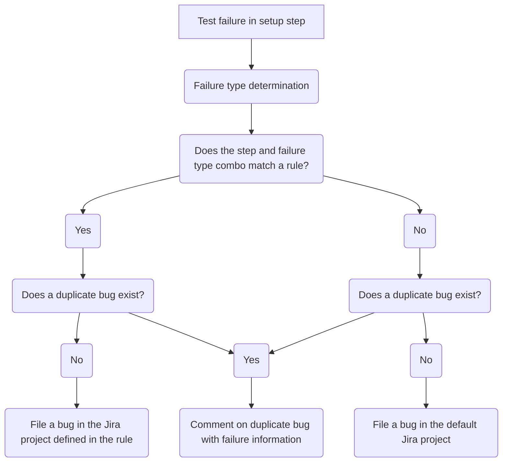
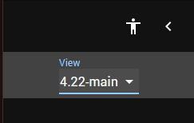

# Reporting Guide<!-- omit from toc -->

## Table of Contents<!-- omit from toc -->

- [TestGrid](#testgrid)
  - [What is TestGrid?](#what-is-testgrid)
  - [How do I Report Jobs to TestGrid?](#how-do-i-report-jobs-to-testgrid)
  - [TestGrid Dashboard Creation and Modification Automation](#testgrid-dashboard-creation-and-modification-automation)
- [Slack](#slack)
  - [How to Setup Slack Alerts for a Scenario](#how-to-setup-slack-alerts-for-a-scenario)
- [Failure Handling (Jira)](#failure-handling-jira)
  - [How Failures Are Reported to Jira](#how-failures-are-reported-to-jira)
    - [Example](#example)
  - [How To Add Jira Reporting to a Scenario](#how-to-add-jira-reporting-to-a-scenario)
- [Component Readiness](#component-readiness)
  - [Summary](#summary)
  - [Prerequisites](#prerequisites)
  - [General Information](#general-information)
  - [CI Operator Job Configuration](#ci-operator-job-configuration)
  - [Sippy](#sippy)
  - [CI Test Mapping](#ci-test-mapping)
  - [Verification](#verification)

## TestGrid

### What is TestGrid?

TestGrid is a Kubernetes community project that allows users to create dashboards of Prow job results. TestGrid uses its configuration files to build these dashboards, retrieve the Prow job results of all CI Operator Jobs defined in the dashboards, and displays the results in a grid pattern.

Please see the following resources for more information about TestGrid:

- [TestGrid Homepage](https://testgrid.k8s.io/)
- [TestGrid Documentation and Source Code](https://github.com/kubernetes/test-infra/tree/master/testgrid)

### How do I Report Jobs to TestGrid?

We have been able to eliminate a manual process for reporting CI Operator Jobs to TestGrid. The most important thing to know about how CI Operator Jobs are reported to the `-lp-interop` dashboards in TestGrid is that the automation that makes it happen looks for the unique identifier `-lp-interop` in the name of the Prow job.

As you may have read in other documents in this repository, you will need to append `-lp-interop` to the end of of your configuration file's filename when you create it. When we create configuration files in OpenShift CI, as you may know, the format for the filenames is `{GitHub Organization}-{GitHub Repository}-{Branch}__****.yaml`. After the `{Branch}` section of the filename, anything can be appended to the end. The text appended to the end is called a "variant". The use of variants will come in handy if we test multiple versions of a layered product or of OpenShift. Please add `-lp-interop` to the "variant" section of the filename.

**Examples:**

- `ci-operator/config/windup/windup-ui-tests/windup-windup-ui-tests-main-lp-interop.yaml`: Will be reported because `-lp-interop` is in the filename.
- `ci-operator/config/windup/windup-ui-tests/windup-windup-ui-tests-main.yaml`: Will NOT get reported because `-lp-interop` is not found in the filename.

### TestGrid Dashboard Creation and Modification Automation

The automation we use to automatically create and modify dashboards in TestGrid can be found in the [openshift/ci-tools](https://github.com/openshift/ci-tools) repository. We utilize the [testgrid-config-generator] tool in that repository to find any Prow jobs that contain either `-lp-interop` in their names. If a new Prow job is found that isn't being reported, the tool will create a new dashboard or modify an existing dashboard to report that CI Operator Job to TestGrid appropriately. After the tool has run, it will create a pull request in the [kubernetes/test-infra][kubernetes-test-infra] repository to finalize the changes.

The [testgrid-config-generator] tool is run daily and you should not need to force it to run. After the tools runs, it may take some time for the pull request to be merged into the [kubernetes-test-infra] repository. Once the pull request is merged, it will start to show in TestGrid.

To add support for automatically detecting layered product interoperability CI Operator Jobs, a [PR](https://github.com/openshift/ci-tools/pull/3289) was opened to [testgrid-config-generator] support these unique identifier.

> **NOTE:**
>
> The only CI Operator Jobs that will be automatically reported in TestGrid are the CI Operator Jobs in the `main` branch of the [openshift/release](https://github.com/openshift/release).

**Verification:** After the [testgrid-config-generator] pull request is merged into [kubernetes-test-infra], confirm your CI Operator Job appears in the expected `-lp-interop` TestGrid dashboard the following day.

## Slack

[OpenShift CI allows to set up Slack alerts](https://docs.ci.openshift.org/docs/how-tos/notification/) for our scenarios. The CSPI Interop team has decided that we should set up this Slack integration for each of our scenarios. Each scenario should alert to the Slack channel that product QE decides. The channel must be public and in redhat-internal.slack.com.

### How to Setup Slack Alerts for a Scenario

1. In the [openshift/release](https://github.com/openshift/release) repository, after you have created a CI configuration file for your scenario in the `ci-operator/config/...` directory and ran the `make update` or `make jobs` command, you should be able to find a CI Operator Job file for your CI configuration generated under `ci-operator/jobs/....`. Find the CI Operator Job file that ends in `-periodics.yaml` and open it.
2. This file may contain multiple periodic CI Operator Jobs for the same repository, so find the periodic CI Operator Job that matches the CI configuration you'd like alerts for. If you are working with layered product interop testing, the CI Operator Job name should include `-lp-interop`. In this example, the CI Operator Job name is `periodic-ci-windup-windup-ui-tests-v1.0-mtr-ocp4.13-lp-interop-mtr-interop-aws`.
3. Add a reporter_config stanza, replace the `channel:` value with the channel you're PQE team would like to use and update the `report_template:` with a different message (if you'd like to, this one is very generic and will work in most cases):

```yaml
  name: periodic-ci-windup-windup-ui-tests-v1.0-mtr-ocp4.13-lp-interop-mtr-interop-aws
  reporter_config:
    slack:
      channel: '#mtr-interop'
      job_states_to_report:
      - success
      - failure
      - error
      report_template: '{{if eq .Status.State "success"}} :slack-green: Job *{{.Spec.Job}}*
        ended with *{{.Status.State}}*. <{{.Status.URL}}|View logs> {{else}} :failed:
        Job *{{.Spec.Job}}* ended with *{{.Status.State}}*. <{{.Status.URL}}|View
        logs> {{end}}'
```

4. Commit your changes and open a Pull Request.

> **IMPORTANT**
>
> Please see the [official documentation](https://docs.ci.openshift.org/docs/how-tos/notification/) for more information about how to configure Slack alerts further.


[testgrid-config-generator]: https://github.com/openshift/ci-tools/tree/master/cmd/testgrid-config-generator
[kubernetes-test-infra]: https://github.com/kubernetes/test-infra

## Failure Handling (Jira)

### How Failures Are Reported to Jira

Failures are reported to Jira using the [firewatch tool](https://github.com/CSPI-QE/firewatch). This tool is used to react to failures in OpenShift CI Operator Jobs. This tool uses a configuration defined for each CI Operator Job to help it determine how it should report certain bugs. For a more technical understanding of how to use the tool and build the configuration properly, please see the documentation below:

- [Getting started](https://github.com/CSPI-QE/firewatch/blob/main/README.md)
- [How to define the configuration](https://github.com/CSPI-QE/firewatch/blob/main/docs/cli_usage_guide.md#defining-the-configuration)

#### Example

For the purposes of how this automation works, here is a fairly simple example:

Each CI Operator Job in OpenShift CI consists of different steps, for this example we will say our CI Operator Job has three steps: `setup`, `test`, and `teardown`. In each of these steps, as far as the automation is concerned, there are two types of failures: `pod_failure` which means the step's script exited with a non-zero exit code and `test_failure` which means the step generated a JUnit XML file and a failure in the XML was found.

For this example, lets set some plain-english rules to make it a little easier to understand:

- If there is any type of failure in the `setup` step, report it to Interop QE (INTEROP Jira project)
- If there is any type of failure in the `teardown` step, report it to Interop QE (INTEROP Jira project)
- If there is a `pod_failure` found in the `test` step, report it to Interop QE (INTEROP Jira project)
- If there is a `test_failure` found in the `test` step, report it to Product QE (PQE Jira project)

Using the logic outlined above, we can generate a firewatch config that will result in bugs being filed to the right teams with as much information as possible to help the engineer looking at the bug. The configuration for this logic would look something like this:

```json
{
"failure_rules":
[
  {"step": "setup", "failure_type": "all", "classification": "Lorem Ipsum", "jira_project": "INTEROP", "group": {"name": "cluster", "priority": 1}, "jira_additional_labels": ["!default"]},
  {"step": "test", "failure_type": "pod_failure", "classification":  "Lorem Ipsum", "jira_project": "INTEROP", "group": {"name": "lp-tests", "priority": 1}, "jira_additional_labels": ["!default", "interop-tests"]},
  {"step": "test", "failure_type": "test_failure", "classification":  "Lorem Ipsum", "jira_project": "PQE", "group": {"name": "lp-tests", "priority": 1}, "jira_additional_labels": ["!default", "interop-tests"]},
  {"step": "teardown", "failure_type": "all", "classification": "Lorem Ipsum", "jira_project": "INTEROP", "group": {"name": "cluster", "priority": 2}, "jira_additional_labels": ["!default"]}
]
}
```

For the sake of this documentation, we will not go very deep into this configuration (again, see the documentation linked above) but this configuration will result in the plain-english rules we outlined earlier. Here is a highly-simplified flowchart of how this works:



### How To Add Jira Reporting to a Scenario

**If you currently use the ipi-aws workflow:**

1. Ask your PQE contact which Jira project they would like test failures to be reported to
2. Modify the scenario to use the `firewatch-ipi-aws` workflow instead of the `ipi-aws` workflow
3. Add the required environment variables:
   - `FIREWATCH_DEFAULT_JIRA_PROJECT`: This is the Jira project you'd like tickets to be filed to if the failure found does not match any rules. For Interop QE, this will probably be set to `LPINTEROP`
   - `FIREWATCH_CONFIG`: Where we define the rules for which tickets get filed where. Please see the [How to define the configuration](https://github.com/CSPI-QE/firewatch/blob/main/docs/cli_usage_guide.md#defining-the-configuration) section of the Firewatch documentation for help defining this variable.
   - `FIREWATCH_JIRA_SERVER`: `https://issues.redhat.com`
     - This value always defaults to the stage server to avoid unwanted bugs.
   - `FIREWATCH_DEFAULT_JIRA_ADDITIONAL_LABELS` : Adding the following 3 labels to every firewatch config step: `["<ocp-version>-lp","self-managed-lp","<scenario-short-name-lp>"]`

**If you currently use a custom workflow:**

1. Add the `firewatch-report-issues` ref to the end of the post steps in your workflow
2. Ask your PQE contact which Jira project they would like test failures to be reported to
3. Add the required environment variables:
   - `FIREWATCH_DEFAULT_JIRA_PROJECT`: This is the Jira project you'd like tickets to be filed to if the failure found does not match any rules. For Interop QE, this will probably be set to `LPINTEROP`
   - `FIREWATCH_CONFIG`: Where we define the rules for which tickets get filed where. Please see the [How to define the configuration](https://github.com/CSPI-QE/firewatch/blob/main/docs/cli_usage_guide.md#defining-the-configuration) section of the Firewatch documentation for help defining this variable.
   - `FIREWATCH_JIRA_SERVER`: `https://issues.redhat.com`
     - This value always defaults to the stage server to avoid unwanted bugs.
   - `FIREWATCH_DEFAULT_JIRA_ADDITIONAL_LABELS` : Adding the following 3 labels to every firewatch config step: `["<ocp-version>-lp","<platform-name>-lp","<scenario-short-name-lp>"]`

Please see [this PR](https://github.com/openshift/release/pull/39700/files) as an example of how to add these values to your CI Operator Job configuration.

> **IMPORTANT**
>
> When defining the `FIREWATCH_CONFIG` variable, please try to cover every step that is executed during your CI Operator Job, you can view the steps that are run by going to a recent run of your CI Operator Job and viewing the artifacts. Each step should have a folder for it's artifacts and logs that you can use to build your config. If you happen to miss one of the steps and a failure occurs in that step, it will cause the failure to not match any of the rules in the config. In that case, a generic bug for the failure will be filed in the `FIREWATCH_DEFAULT_JIRA_PROJECT` project.

## Component Readiness

[Component Readiness](https://sippy.dptools.openshift.org/sippy-ng/component_readiness/main) (CR) is a dashboard within
[Sippy](https://sippy.dptools.openshift.org/sippy-ng/) ([Source Code](https://github.com/openshift/sippy/)) that tracks historical test health across OpenShift
CI runs. CR surfaces regressions by comparing a sample Release window against a baseline, broken down by variant (platform, network, architecture, and Layered
Product (LP)). LP is any Red Hat product that is tested for compatibility with OpenShift. CI Operator Job run results for LP-OCP Compatibility Test Suites (TS)
appear in CR once the job is registered in both [openshift/sippy](https://github.com/openshift/sippy/) and
[openshift-eng/ci-test-mapping](https://github.com/openshift-eng/ci-test-mapping). Individual Test Cases (TC) that appear within those TSs are mapped to CR
Components and Capabilities by `ci-test-mapping`.

### Summary

Onboarding an LP OCP Compatibility (LP OCP Compat) Job into CR requires three pull requests (PR):
| PR Target Repo                                                                    | Files Changed                                                                                                                                                             |
|-----------------------------------------------------------------------------------|---------------------------------------------------------------------------------------------------------------------------------------------------------------------------|
| [openshift/release](https://github.com/openshift/release)                         | CI Operator Job Conf. files under `ci-operator/config/`                                                                                                                   |
| [openshift/sippy](https://github.com/openshift/sippy)                             | `pkg/db/suites.go` (if needed), `pkg/variantregistry/ocp.go`, `config/views.yaml`, `pkg/variantregistry/snapshot.yaml`                                                    |
| [openshift-eng/ci-test-mapping](https://github.com/openshift-eng/ci-test-mapping) | `config/openshift-eng.yaml`, `pkg/components/<lpComp>/component.go`, `pkg/components/<lpComp>/capabilities.go`, `pkg/registry/registry.go`, regenerated `mapping.json`    |

The three PRs are independent of each other and can be opened in parallel. The Sippy and ci-test-mapping PRs both depend on the CI Operator Job already being
CR-compliant and producing JUnit XML with the correct TS name prefix (see [Prerequisites](#prerequisites)). It is recommended to determine the correct JUnit
output to be produced by the `openshift/release` PR first, as this directly affects the content of the other two PRs. All three must be merged before LP test
results appear correctly in CR. For an example, see
[pkg/components/quaylpinterop/](https://github.com/openshift-eng/ci-test-mapping/tree/main/pkg/components/quaylpinterop/) in `ci-test-mapping`.

### Prerequisites

Complete the following before opening the Sippy or ci-test-mapping PR.

 1. **Make the CI Operator Job CR-compliant.** This is a hard prerequisite; neither the Sippy PR nor the ci-test-mapping PR will be effective without it. CI
    Operator Job Conf. is documented in the [CI Operator Job Configuration](#ci-operator-job-configuration) section. The job must produce JUnit XML with the
    `DR__RP__CR_COMP_NAME` value (`lp-ocp-compat--<LP-name>`) as the `<testsuite name="...">` attribute.

    To verify: JUnit XML files from a CI Operator Job Run are in the Prow Job Artifacts directory, accessible via the "Artifacts" link on the Prow Job page (a
    Prow Job page is the web UI page for a single CI Operator Job Run, accessible from [prow.ci.openshift.org](https://prow.ci.openshift.org) by searching for
    the job name or via a link in a GitHub Pull Request's CI Status Checks; each run page shows an "Artifacts" link that leads to a browsable artifact
    directory tree, with JUnit XML files located under the sub-directory for the Test Step, for example, `artifacts/<jobShortName>/<stepName>/artifacts/`).
    Open the JUnit XML files and confirm that each `<testsuite name="...">` begins with the expected `lp-ocp-compat--<LP-name>` prefix.

 2. **Identify the LP name.** The LP name is used in CI Operator Job Conf., Sippy CR Variant labels, and ci-test-mapping component package naming. Additional
    repo-specific prerequisites are listed under [Sippy Prerequisites](#sippy-prerequisites) and
    [ci-test-mapping Prerequisites](#ci-test-mapping-prerequisites).

### General Information

**LP OCP Compat Dashboard Views:** CR organizes results into named Views. LP OCP Compat Dashboard Views for a given OpenShift Release follow the naming pattern
`<ocpRelease>-LP-OCP-Compat--<lpVer>`, where `<ocpRelease>` is the OpenShift y-stream Minor Release (for example, `4.22`) on which the LP is installed, and
`<lpVer>` indicates the LP version being tested (`lpGA` for LP General Availability (GA) versions, `lpMainline` for LP mainline versions, or a specific version
such as `lp1.2` for LP version 1.2). For example, the LP OCP Compat View for OCP 4.22-based LP GA testing is named `4.22-LP-OCP-Compat--lpGA`. Additional View
families exist: `<ocpRelease>-LP-Chaos--lpMainline` (LP chaos testing) and `<ocpRelease>-LP-Interop--lpMainline` (LP interop testing). For LP OCP Compat
onboarding the relevant Views are `*-LP-OCP-Compat--lpGA` (most LPs) and `*-LP-OCP-Compat--lpMainline` (LPs that test against their own mainline version).

To navigate to a View, open [CR](https://sippy.dptools.openshift.org/sippy-ng/component_readiness/main) and click `View` in the top-left corner:



Select the desired View from the list, or use a direct URL with the `view=` query parameter, such as
[4.22-LP-OCP-Compat--lpGA](https://sippy.dptools.openshift.org/sippy-ng/component_readiness/main?view=4.22-LP-OCP-Compat--lpGA).

**Where Views are defined:** Supported Releases and their View identifiers are listed in
[config/views.yaml](https://github.com/openshift/sippy/blob/main/config/views.yaml) in the Sippy repository. Entries with names matching `*-LP-OCP-Compat--*`
define the LP OCP Compat Dashboard Views; this file is the source of truth for the correct `view=` value for a given OCP Release.

**Maintainers:** Sippy and CR are maintained by the Technical Release Team (TRT). The `#forum-ocp-release-oversight` Slack channel is the point of contact for
Sippy and CR questions.

**Release rotation:** When a new OpenShift Minor Release reaches GA, TRT adds the corresponding View blocks (such as `<ocpRelease>-LP-OCP-Compat--lpGA`) to
`config/views.yaml` for the next Minor Release.

**Test Suite and Test Case terminology:** A Test Suite (TS) corresponds to a JUnit XML `<testsuite name="...">` element. The `name` attribute value is what
Sippy and `ci-test-mapping` use for matching against configured patterns. A Test Case (TC) corresponds to a `<testcase>` element nested within a `<testsuite>`.

**CR architecture and LP fit:** In the native OCP context, a CR Component maps to an individual OCP software component (such as `etcd` or `kube-apiserver`) and
a CR View maps 1:1 to an OCP Minor Release. LP OCP Compat onboarding adapts this model: each LP is treated as a single CR Component representing the entire
product, not the individual software components that make up that product. The `LP-OCP-Compat` View family is therefore not 1:1 to a product; it is a test
group -- a collection of LP compatibility test results across multiple products for a given OCP Release. Compatibility testing is a whole-system test: whether
the LP installs and operates correctly on the OCP cluster, with no visibility into the LP's internal component breakdown.

**CR-compliant CI Operator Job Conf.:** For the steps required to configure a CI Operator Job so that its results are parsed correctly by CR, see the [CI
Operator Job Configuration](#ci-operator-job-configuration) section.

### CI Operator Job Configuration

This section documents the changes required in [openshift/release](https://github.com/openshift/release) to make a CI Operator Job CR-compliant, as summarized
in the table above. The [openshift/sippy](https://github.com/openshift/sippy) and [openshift-eng/ci-test-mapping](https://github.com/openshift-eng/ci-test-mapping)
PRs both depend on this configuration being in place and producing correct JUnit output before they take effect.

The CI Operator Job Conf. must satisfy two requirements:
 1. The generated CI Operator Job name must contain the sub-string `-<lpVer>-lp-ocp-compat-cr--<lpName>-` so that `setLayeredProduct()` in Sippy correctly
    assigns the `LayeredProduct` CR Variant label.
 2. The `DR__RP__CR_COMP_NAME` Environment Variable must be set to `lp-ocp-compat--<LP-name>` in the `.tests[].steps.env` block so that JUnit output uses the
    correct `<testsuite name="...">` prefix.

----
#### Job Name Pattern

The CI Operator Job name is generated from the CI Operator Job Conf. file path and the `.tests[].as` value (the test's short Job name). Three possibilities
cover the standard LP OCP Compat use cases, all producing the same `-<lpVer>-lp-ocp-compat-cr--<lpName>-` sub-string, satisfying the `setLayeredProduct()`
sub-string match.
 1. **Dedicated `lp-ocp-compat` CI Operator Job Conf. Variant file:**
  - CI Operator Job Conf. file path: `ci-operator/config/<lpOrg>/<lpRepo>/<lpOrg>-<lpRepo>-<lpBranch>__<lpVariants>-<lpVer>-lp-ocp-compat.yaml`
  - Set `.tests[].as: cr--<lpName>--<testVariants>`
 2. **Existing Variant file with an `lp-ocp-compat-cr` test name:**
  - CI Operator Job Conf. file path: `ci-operator/config/<lpOrg>/<lpRepo>/<lpOrg>-<lpRepo>-<lpBranch>__<lpVariants>-<lpVer>.yaml`
  - Set `.tests[].as: lp-ocp-compat-cr--<lpName>--<testVariants>`
 3. **LP hosts the job in its own CI Operator Job Conf. file:**
  - CI Operator Job Conf. file path: `ci-operator/config/<lpOrg>/<lpRepo>/<lpOrg>-<lpRepo>-<lpBranch>__<lpVariants>.yaml` (when the other two patterns cannot
    be used as the file name).
  - Set `.tests[].as: <lpVer>-lp-ocp-compat-cr--<lpName>--<testVariants>`

**Note:**
- The `<lpVer>` indicates the LP version being tested. Possible values:
  - `lpGA`        --  LP General Availability version.
  - `lpMainline`  --  LP mainline/development version.
  - `lp<X.Y>`     --  A specific LP version (for example, `lp1.2`).
- The OCP release segment in the CI Operator Job name must use the `-ocp-<ocpRelease>-` form, with each segment separated by `-`. For example, use
  `-ocp-4.22-`, not `-ocp4.22-`. Sippy does not pick up Job results when the release value is concatenated without the separating hyphen.

----
#### Ensuring JUnit XML TS Names Have Correct Prefix

The following changes are required:
 1. Set these two Environment Variables in the CI Operator Job Conf. file (`ci-operator/config/**/*.yaml`) inside the `.tests[].steps.env` block.
    ```yaml
     ...
    tests:
      - as: cr--my-product--aws
        steps:
          env:
            MAP_TESTS: "true"
            DR__RP__CR_COMP_NAME: lp-ocp-compat--My-product
     ...
    ```
    **Note:**
    - The value `lp-ocp-compat--My-product` becomes the `<testsuite name="...">` attribute in JUnit XML result files. This must satisfy the
      [`testSuitePatterns`](https://github.com/openshift/sippy/blob/main/pkg/db/suites.go) RegEx pattern and the
      [`includeSuitePatterns`](https://github.com/openshift-eng/ci-test-mapping/blob/main/config/openshift-eng.yaml) SQL `LIKE` pattern.
    - `DR__RP__CR_COMP_NAME` must be set in this file whenever the Job executes the
      [`mpiit-data-router-reporter`](https://github.com/openshift/release/blob/main/ci-operator/step-registry/mpiit/data-router-reporter/mpiit-data-router-reporter-commands.sh)
      CI Operator Step (directly, or indirectly via a CI Operator Chain or CI Operator Workflow, such as
      [`firewatch-ipi-aws-cr`](https://steps.ci.openshift.org/workflow/firewatch-ipi-aws-cr)), or the Job incorporates a Single-Stage Test (via
      [`literal_step`](https://steps.ci.openshift.org/ci-operator-reference) stanza) performing an equivalent action.
 2. In the CI Operator Step Script that performs the test and produces the JUnit XML result files (the post-processing helper is provided by
    [RedHatQE/OpenShift-LP-QE--Tools](https://github.com/RedHatQE/OpenShift-LP-QE--Tools)):
    ```bash
    if [ "${MAP_TESTS}" = "true" ]; then
        eval "$(
            typeset -a _fURL=()
            type -t wget 1>/dev/null && _fURL=(wget -qO-) || _fURL=(curl -fsSL)
            "${_fURL[@]}" \
    https://raw.githubusercontent.com/RedHatQE/OpenShift-LP-QE--Tools/refs/heads/main/libs/bash/ci-operator/interop/common/ExitTrap--PostProcessPrep.sh
        )"; trap '
            LP_IO__ET_PPP__NEW_TS_NAME="${DR__RP__CR_COMP_NAME}--%s" \
                ExitTrap--PostProcessPrep junit--<testName>.xml
        ' EXIT
    fi
    ```
    **Note:**
    - This script can either be in CI Operator Step Script or the CI Operator Job Conf. file `.tests[].steps.test[].commands` block.
    - Ensure `MAP_TESTS` and `DR__RP__CR_COMP_NAME` are declared in the `.ref.env` block of the Step's CI Operator Step Conf. file
      (`ci-operator/step-registry/**/*-ref.yaml`).
    - The `<testName>` must be unique within the CI Operator Step; consult the Step author for the correct value (preferred), or alternatively use the
      `.ref.as` value from the CI Operator Step Conf. file.

Commit the CI Operator Job Conf. file change in a PR against the `main` branch of [openshift/release](https://github.com/openshift/release) (for example,
`ci-operator/config/myorg/myrepo/myorg-myrepo-main-lpGA-lp-ocp-compat.yaml`).

----
### Sippy

The steps in this section register a CI Operator Job in Sippy so that its Runs appear in CR. Open a PR against [openshift/sippy](https://github.com/openshift/sippy), as summarized in the table above.

The following changes are required:
 1. Ensuring the BigQuery query pattern covers the CI Operator Job (`pkg/variantregistry/ocp.go`: `LoadExpectedJobVariants()`).
 2. Mapping the CI Operator Job name to an `Owner` variant label (`pkg/variantregistry/ocp.go`: `setOwner()`).
 3. Mapping the CI Operator Job name to a `LayeredProduct` variant label (`pkg/variantregistry/ocp.go`: `setLayeredProduct()`).
 4. Including that label in the LP OCP Compat Dashboard Views (`config/views.yaml`).
 5. Regenerating the variant snapshot (`pkg/variantregistry/snapshot.yaml`).
 6. Allowing the TSs to be imported into Sippy's database (`pkg/db/suites.go`).

For standard LP OCP Compat onboardings that follow the `periodic-ci-<org>-<repo>-<branch>-*-<lpVer>-lp-ocp-compat-cr--<lpName>--*` Job naming convention, Steps
1, 2, and 6 can often be skipped (see each Step for details).

Commit all changes in a single PR against the `main` branch of [openshift/sippy](https://github.com/openshift/sippy).

----
#### Sippy Prerequisites

Before opening a PR against [openshift/sippy](https://github.com/openshift/sippy), gather the following information.

 1. **TS name prefix:** Identify the TS name prefix present in the JUnit results produced by the CI Operator Job. The JUnit XML files are in the Prow Job
    Artifacts directory, accessible via the "Artifacts" link on the Prow Job page, under the Test Step directory. Look for `<testsuite name="...">` elements;
    the `name` attribute is the prefix Sippy matches against. To establish a consistent prefix, set `DR__RP__CR_COMP_NAME` to `lp-ocp-compat--<LP-name>` in the
    CI Operator Job Conf. (see [Prerequisites](#prerequisites), item 1).

 2. **Stable CI Operator Job name sub-string:** All CI Operator Job Conf. files live in [openshift/release](https://github.com/openshift/release/), under
    `ci-operator/config/<lpOrg>/<lpRepo>/` where `<lpOrg>/<lpRepo>` is the LP Upstream Test repository (not `openshift/release` itself). CI Operator Prow Job
    files under `ci-operator/jobs/` are auto-generated by `make jobs` and must not be edited directly. Find the relevant `.periodics[].name` value in the
    generated file. Generated Prow Job files follow the naming pattern `ci-operator/jobs/<org>/<repo>/<org>-<repo>-<branch>-periodics.yaml`. For example, for
    an LP whose CI Operator Job Conf. is at `ci-operator/config/myorg/myrepo/myorg-myrepo-main__variant1-variant2-lpGA-lp-ocp-compat.yaml`, the generated
    periodics file is at `ci-operator/jobs/myorg/myrepo/myorg-myrepo-main-periodics.yaml`. Search that file for the LP's job name using the variant sub-string
    (for example, `lp-ocp-compat`) as a grep keyword. Job names follow the format `periodic-ci-<org>-<repo>-<branch>-<some-variants>-<testname>`. Identify a
    "stable sub-string" of that name: a part that does not include the OCP release number or branch name and is therefore present regardless of the OCP version
    being tested. For example, given the job name `periodic-ci-myorg-myrepo-v1.2-ocp-4.22-lpGA-lp-ocp-compat-cr--my-product--aws`, the segments `v1.2` (branch)
    and `ocp-4.22` (OCP version as part of CI Operator Job Variant) change per release. The stable sub-string is `-lpga-lp-ocp-compat-cr--my-product--`
    (lower-cased, because the Registry matches against the lower-cased CI Operator Job full name) because it is present in all CI Operator Job Variants. The CR
    Variant (which is a different concept from CI Operator Job Variant) Registry matches literal sub-strings against the lower-cased CI Operator Job full name;
    the first matching entry in `layeredProductPatterns` wins.

----
#### Step 1 -- Confirm BigQuery Job Pattern Match

**File:** [pkg/variantregistry/ocp.go](https://github.com/openshift/sippy/blob/main/pkg/variantregistry/ocp.go)

**Variable:** `queryStr` in function `LoadExpectedJobVariants()`

Sippy populates its variant data from a BigQuery query that is scoped to CI Operator Job names matching one of the patterns in the `prowjob_job_name` column in
the `WHERE` clause. The following pattern is already present in the codebase and covers all standard LP OCP Compat Job names:
```
"periodic-ci-%%-lp-ocp-compat-%%"
```

**Note:**
- A new entry in the `prowjob_job_name` `WHERE` clause is needed only when the CI Operator Job name does not match any existing pattern. For standard LP OCP
  Compat jobs following the `periodic-ci-<org>-<repo>-<some-variants>-<lpVer>-lp-ocp-compat-cr--<lpName>--<other-test-variants>` naming convention, the
  existing `"periodic-ci-%%-lp-ocp-compat-%%"` pattern already matches; skip this step.

----
#### Step 2 -- Map CI Operator Job Name to a CR Variant `Owner`

**File:** [pkg/variantregistry/ocp.go](https://github.com/openshift/sippy/blob/main/pkg/variantregistry/ocp.go)

**Variable:** `ownerPatterns` in function `setOwner()`

The `setOwner()` function assigns the CR Variant `Owner` value based on a sub-string match against the lower-cased CI Operator Job name. The patterns are
scanned top to bottom; the first matching entry wins.
```go
// {sub-string, owner}
{"-lp-ocp-compat-", "lp"},
```

**Note:**
- The sub-string `-lp-ocp-compat-` already maps to owner `"lp"` in the codebase. This is intentionally a broad pattern covering all LP OCP Compat CI Operator
  Jobs, avoiding the need for per-LP entries.
- The sub-string starts and ends with `-`, a good practice to prevent partial-word collisions.

----
#### Step 3 -- Map CI Operator Job Name to a CR Variant `LayeredProduct`

**File:** [pkg/variantregistry/ocp.go](https://github.com/openshift/sippy/blob/main/pkg/variantregistry/ocp.go)

**Variable:** `layeredProductPatterns` in function `setLayeredProduct()`

The `setLayeredProduct()` function assigns the CR Variant `LayeredProduct` value based on a sub-string match against the lower-cased CI Operator Job name. The
patterns are scanned top to bottom; the first matching entry wins.
```go
// {sub-string, product}
{"-lpga-lp-ocp-compat-cr--my-product--", "lp-ocp-compat--my-product--lpGA"},
```

**Placement:** Insert a new row in the appropriate position. If the sub-string does not overlap with any existing entry, placing it at the end is safe. If it
could match a broader existing entry, place it above that entry.

**Rules:**
- **`sub-string` value:** Must appear verbatim in the lower-cased CI Operator Job name. Starting and ending the sub-string with `-` (for example,
  `-lpga-lp-ocp-compat-cr--my-product-`) prevents partial-word collisions. The sub-string must align with the actual CI Operator Job naming convention in
  [openshift/release](https://github.com/openshift/release).
- **`product` value:** Always use the `lp-ocp-compat--<lpName>--<lpVer>` form (double-dash, `--`, to separate prefix), for example,
  `lp-ocp-compat--my-product--lpGA`. This string is used by CR Views to include a specific LP.

----
#### Step 4 -- Include Product in LP OCP Compat Views

**File:** [config/views.yaml](https://github.com/openshift/sippy/blob/main/config/views.yaml)

Add the LP's `product` value to the `.include_variants.LayeredProduct` list in each applicable `<ocpRelease>-LP-OCP-Compat--<lpVer>` View block (see [General
Information](#general-information)), keeping the list alphabetically sorted:
```yaml
- name: 4.22-LP-OCP-Compat--lpGA
  include_variants:
    ...
    LayeredProduct:
      - lp-ocp-compat--a-existing-product
      - lp-ocp-compat--my-product--lpGA   # newly added
      - lp-ocp-compat--z-existing-product
```

The string added here must exactly match the `product` field used in `setLayeredProduct()` (the `lp-ocp-compat--<lpName>--<lpVer>` value). This list is scoped
to the single view block being edited. Most LPs add to the `lpGA` view; add to `lpMainline` only when the LP explicitly tests against its own mainline (not GA)
version. Add the product label to every view block for every OCP Release the LP supports.

----
#### Step 5 -- Update Variant Snapshot

Run the following commands from the root of the [openshift/sippy](https://github.com/openshift/sippy) local clone git WorkTree (a Go toolchain is required):
```bash
make update-variants    # builds the ./sippy executable
./sippy variants snapshot --config ./config/openshift.yaml
```

**Note:**
- Snapshot tests in CI will fail until this command is run and its output is committed.

----
#### Step 6 -- Confirm TS Import Pattern Coverage

**File:** [pkg/db/suites.go](https://github.com/openshift/sippy/blob/main/pkg/db/suites.go)

**Variable:** `testSuitePatterns`

Sippy imports TS names that match either a literal entry in `testSuites` or a regex in `testSuitePatterns`. For LP OCP Compat onboarding, the
`testSuitePatterns` regex is the relevant mechanism. The following LP-oriented patterns are already present in the codebase:

```go
var testSuitePatterns = []*regexp.Regexp{
    regexp.MustCompile(`^lp-chaos--`),
    regexp.MustCompile(`^lp-interop--`),
    regexp.MustCompile(`^lp-ocp-compat--`),
}
```

**Note:**
- A new `regexp.MustCompile(...)` entry is needed only when the CI Operator Job produces a TS name prefix family not covered by any existing pattern. For
  standard LP OCP Compat onboardings where TS names follow the `lp-ocp-compat--<LP-name>--` prefix convention (see [Ensuring JUnit XML TS Names Have Correct
  Prefix](#ensuring-junit-xml-ts-names-have-correct-prefix)), the existing `^lp-ocp-compat--` RegEx pattern already covers the TS names; skip this step in that
  case.

----
### CI Test Mapping

The steps in this section onboard a new LP as CR Component into [openshift-eng/ci-test-mapping](https://github.com/openshift-eng/ci-test-mapping), which maps
Test Suites (TS) to CR Components and Capabilities. Open a PR against [openshift-eng/ci-test-mapping](https://github.com/openshift-eng/ci-test-mapping), as
summarized in the table above. Once mapped, each TC within the LP's TS appears in CR attributed to the correct Component.

----
#### ci-test-mapping Prerequisites

Before opening a PR against [openshift-eng/ci-test-mapping](https://github.com/openshift-eng/ci-test-mapping), verify the following.
 1. **Stable TS string:** See [Sippy Prerequisites](#sippy-prerequisites), item 1.
 2. **Valid `OCPBUGS` Jira Component:** The `.Component.DefaultJiraComponent` field in `pkg/components/<lpComp>/component.go` must correspond to a real Jira
    Component in the [OCPBUGS](https://redhat.atlassian.net/jira/software/c/projects/OCPBUGS/components) project. The Jira Component name should follow the
    pattern `LP--<LP-name>` (for example, `LP--My-product`). If the component does not yet exist, it can be requested at
    [new OCPBUGS component request](https://devservices.dpp.openshift.com/support/new_ocpbugs_component/).

----
#### Step 1 -- Register TS Name Pattern

**File:** [config/openshift-eng.yaml](https://github.com/openshift-eng/ci-test-mapping/blob/main/config/openshift-eng.yaml)

Add an entry for the LP TS to `includeSuitePatterns`. The pattern syntax uses SQL `LIKE`-style wildcards (`%` matches any sequence of characters):
```yaml
 ...
includeSuitePatterns:
 ...
  - "lp-ocp-compat--%"
 ...
```

The `ci-test-mapping` uses this configuration to fetch TCs included in the matching TS names from BigQuery. The trailing `%` is a SQL `LIKE` wildcard matching
any character sequence. This pattern matches `lp-ocp-compat--lp-product-a` and `lp-ocp-compat--lp-product-b`. Always include the trailing `%`.

**Note:**
- A new entry is needed only when no existing pattern covers the LP TS names. For standard LP OCP Compat onboardings where TS names follow the
  `lp-ocp-compat--<LP-name>--` prefix convention (set via `DR__RP__CR_COMP_NAME`, see [Ensuring JUnit XML TS Names Have Correct
  Prefix](#ensuring-junit-xml-ts-names-have-correct-prefix)), the existing `"lp-ocp-compat--%"` SQL `LIKE` pattern already covers them; skip this step in that
  case.
- Insert the new entry in alphabetical order alongside the existing entries.

----
#### Step 2 -- Add Component Package

Create a directory `pkg/components/<lpComp>/` in the git WorkTree. The directory name is also the Go Package name, therefore must follow Go Package naming
rules (`[a-z][a-z0-9]*`). Prefix the name with `lp` (for example, `pkg/components/lpmyproduct/`) to clearly distinguish LP-style CR Component packages from the
native OCP CR Component packages that share the same repository. The directory must contain two files: `component.go` and `capabilities.go`.

----
##### `component.go`

[pkg/components/quaylpinterop/component.go](https://github.com/openshift-eng/ci-test-mapping/blob/main/pkg/components/quaylpinterop/component.go) serves as
example.

The file defines the CR Component Struct, its name, the Jira Component, and the TS matchers:
- `.Component.Name`: The CR Component Display Name, by convention is passed to
  [`r.Register()`](https://github.com/openshift-eng/ci-test-mapping/blob/main/pkg/registry/registry.go) as its first parameter. The `Name` string is displayed
  as the CR Component label in the CR Dashboard. Use the `LP--<LP-name>` form (for example, `LP--My-product`).
- `.Component.DefaultJiraComponent`: The [`OCPBUGS`](https://redhat.atlassian.net/jira/software/c/projects/OCPBUGS/components) Jira Component name, following
  the pattern `LP--<LP-name>` (for example, `LP--My-product`). Run `./ci-test-mapping jira-verify` (see Note below) to confirm this value resolves to a real
  Jira Component before opening the PR. By convention this should match the above `.Component.Name`.
- `.Component.Matchers`: Defines the TC ownership matching rules for this Component.
  - `.Component.Matchers[].SuiteRegEx`: Matches a RegEx pattern against the TS name. Use this for the standard LP TS prefixes (`^lp-ocp-compat--my-product--`,
    `^lp-interop--my-product--`, `^lp-chaos--my-product--`).

Boilerplate:
> **Instructions:**
> - Replace the following placeholders:
>   - `lpmyproduct`: lp-prefixed lower-cased Go Package name.
>   - `myproduct`: non-hyphenated lower-cased product name.
>   - `My-product`: hyphenated capitalized on first letter product name.
```go
package lpmyproduct

import (
    "regexp"

    v1 "github.com/openshift-eng/ci-test-mapping/pkg/api/types/v1"
    "github.com/openshift-eng/ci-test-mapping/pkg/config"
)

type Component struct {
    *config.Component
}

var LPmyproductComponent = Component{
    Component: &config.Component{
        Name:                 "LP--My-product",
        Operators:            []string{},
        DefaultJiraComponent: "LP--My-product",
        Matchers: []config.ComponentMatcher{
            {SuiteRegEx: regexp.MustCompile(`^lp-ocp-compat--My-product--`)},
        },
    },
}

func (c *Component) IdentifyTest(test *v1.TestInfo) (*v1.TestOwnership, error) {
    if matcher := c.FindMatch(test); matcher != nil {
        jira := matcher.JiraComponent
        if jira == "" {
            jira = c.DefaultJiraComponent
        }
        return &v1.TestOwnership{
            Name:           test.Name,
            Component:      c.Name,
            JIRAComponent:  jira,
            Priority:       matcher.Priority,
            Capabilities:   append(matcher.Capabilities, identifyCapabilities(test)...),
        }, nil
    }
    return nil, nil
}

func (c *Component) StableID(test *v1.TestInfo) string {
    if stableName, ok := c.TestRenames[test.Name]; ok {
        return stableName
    }
    return test.Name
}

func (c *Component) JiraComponents() (components []string) {
    components = []string{c.DefaultJiraComponent}
    for _, m := range c.Matchers {
        components = append(components, m.JiraComponent)
    }
    return components
}
```

**Note:**
- Run the following from the root of the [openshift-eng/ci-test-mapping](https://github.com/openshift-eng/ci-test-mapping) local clone git WorkTree. A Go
  toolchain is required. The environment variables `JIRA_USER` (Jira account username, typically the account email), `JIRA_TOKEN` (Personal API Token from the
  Jira Profile page), and `JIRA_TOKEN_BASIC` (base64-encoded `username:token`) must be set before running `jira-verify`. Fix any reported errors before
  proceeding.
  ```bash
  export JIRA_TOKEN_BASIC="$(
      typeset jiraAuth="${JIRA_USER}:${JIRA_TOKEN}"
      case $(uname -s) in
        (Linux)   echo -n "${jiraAuth}" | base64 -w 0;;
        (Darwin)  echo -n "${jiraAuth}" | base64 | tr -d '\n';;
      esac
  )"

  go build -o ./ci-test-mapping .
  ./ci-test-mapping jira-verify
  ```

----
##### `capabilities.go`

[pkg/components/quaylpinterop/capabilities.go](https://github.com/openshift-eng/ci-test-mapping/blob/main/pkg/components/quaylpinterop/capabilities.go) serves
as example.

The file defines the CR Component Capabilities:
- The default Capabilities are sufficient.

Boilerplate:
> **Instructions:**
> - Replace the following placeholder:
>   - `lpmyproduct`: lp-prefixed lower-cased Go Package name.
```go
package lpmyproduct

import (
    v1 "github.com/openshift-eng/ci-test-mapping/pkg/api/types/v1"
    "github.com/openshift-eng/ci-test-mapping/pkg/util"
)

func identifyCapabilities(test *v1.TestInfo) []string {
    capabilities := util.DefaultCapabilities(test)
    return capabilities
}
```

----
#### Step 3 -- Register the Component

**File:** [pkg/registry/registry.go](https://github.com/openshift-eng/ci-test-mapping/blob/main/pkg/registry/registry.go)

**Function:** `NewComponentRegistry()`

Add the import and `Register` call alongside the other LP Component registrations:

Boilerplate:
> **Instructions:**
> - Replace the following placeholders:
>   - `lpmyproduct`: lp-prefixed lower-cased Go Package name.
>   - `myproduct`: non-hyphenated lower-cased product name.
>   - `My-product`: hyphenated capitalized on first letter product name.
```go
package registry

import (
 ...
    "github.com/openshift-eng/ci-test-mapping/pkg/components/lpmyproduct"
 ...
)
 ...
func NewComponentRegistry() *Registry {
 ...
    r.Register("LP--My-product", &lpmyproduct.LPmyproductComponent)
 ...
}
```

The string passed to `Register` must exactly match the `Name` field set in the `config.Component` block in `component.go`.

----
#### Step 4 -- Validate and Finalize

Run the following from the root of the [openshift-eng/ci-test-mapping](https://github.com/openshift-eng/ci-test-mapping) local clone git WorkTree:
```bash
make mapping
```

Commit all changes in a single PR against the `main` branch of [openshift-eng/ci-test-mapping](https://github.com/openshift-eng/ci-test-mapping).

### Verification

After all three PRs are merged, navigate to the CR LP OCP Compat View for the target OCP release (for example,
[4.22-LP-OCP-Compat--lpGA](https://sippy.dptools.openshift.org/sippy-ng/component_readiness/main?view=4.22-LP-OCP-Compat--lpGA)) and confirm the product label
appears in the results. If the product does not appear, contact TRT at `#forum-ocp-release-oversight` on Slack.

